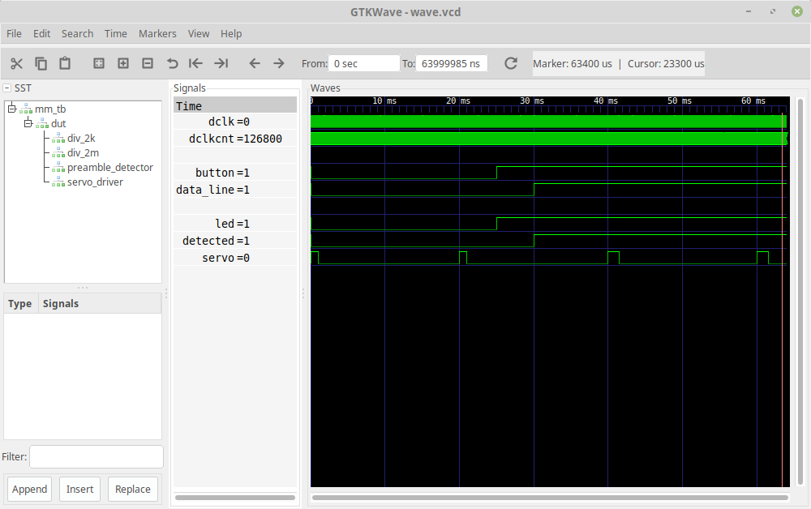

# mm-challenge

A mystery machine challenge project given to me by $COMPANY. If you wish to know the details email me, otherwise I'll leave this description as hand-wavy as possible in case they decide to recycle this challenge for others.

Written in VHDL-2008 and utilized GHDL, make, and GTKWave to pull this all together. There exists a crude testbench for each module. If you want to see this in real hardware visit [mm-supa-challenge](https://github.com/essess/mm-supa-challenge)

